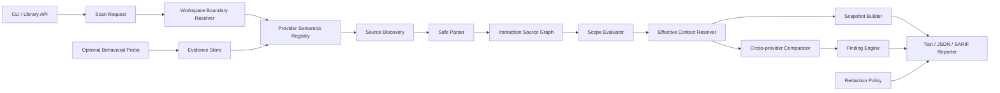

# Agent Config Inspector 최초 설계

> 문서 상태: Living design — Phase 8c repository MCP inventory implemented, v0.9.0 development
>
> 문서 버전: 0.9.0-draft
>
> 기준일: 2026-07-24
>
> 대상 독자: 구현자, 기여자, 보안 검토자, 초기 사용자
>
> 제품명: **Agent Config Inspector**
>
> 저장소 및 실행 파일명: `agent-config-inspector`

## 1. 요약

**Agent Config Inspector**는 하나의 소프트웨어 저장소에서 여러 AI 코딩 도구가 어떤
지침을 발견하고, 어떤 순서로 합치며, 특정 파일을 작업할 때 최종적으로 어떤
지침 집합을 받게 되는지 계산하고 비교하는 로컬 우선(local-first) CLI다.

이름은 대상인 **agent configuration**과 역할인 **inspector**를 직접 나타낸다. 초기에는
instruction discovery와 resolution을 다루고, 향후 skill, hook, MCP configuration으로
범위가 확장되어도 이름의 의미를 유지한다. `inspector`는 설정을 생성하거나 실행하지 않고
출처·범위·우선순위를 읽고 설명한다는 제품 경계를 함께 전달한다.

최초 릴리스가 지원하는 provider는 다음 두 개뿐이다.

- Anthropic Claude Code
- OpenAI Codex CLI

Claude Code와 Codex CLI의 discovery, scope, import, precedence를 먼저 충분한 깊이로
구현하고 검증한다. **첫 개발자 preview와 첫 공개 MVP 모두 이 두 provider만 지원한다.**
Gemini CLI, Kimi Code CLI, Grok Build, GitHub Copilot은 초기 범위에 포함하지 않으며,
각각 별도의 후속 phase와 release gate를 통과한 뒤 한 단계씩 추가한다. 문서에 후속
adapter 설계가 존재하더라도 실제 adapter와 fixture가 release에 포함되기 전에는
`unsupported`로 표시한다.

이 문단의 “최초 릴리스”는 역사적 범위를 뜻한다. v0.3.0에는 Gemini CLI가 추가되었고,
v0.4.0에는 Phase 4의 Kimi Code CLI baseline adapter가 추가되었다. Grok Build Phase 5는
의도적으로 건너뛰었고 Grok은 계속 `unsupported`다. 현재 source에는 Phase 6의 격리된
행동 probe와 Phase 7의 GitHub Copilot CLI baseline adapter는 v0.6.0에 포함되었다.
Phase 8a에서는 Claude Code와 Codex CLI의 repository-owned Agent Skills inventory를
별도 configuration surface로 추가했다. Phase 8b에서는 같은 두 provider의
repository-owned custom agents inventory를 추가했다. Phase 8c에서는 repository MCP
declaration inventory를 독립 surface로 추가했다. description과 prompt 및
도구·모델·MCP 설정값은 출력하지 않으며 agent를 실행하거나 delegation을 예측하지 않는다.
MCP command, URL, credential, tool/approval 값도 출력하지 않고 server를 시작하거나 접속하지 않는다.
Copilot coding agent, code review, VS Code 표면은 계속 `unsupported`다.

도구가 해결하려는 질문은 단순하다.

> 왜 같은 저장소인데 Codex와 Claude Code가 서로 다른 지침을 받는가?

후속 provider가 추가되면 같은 질문의 비교 대상을 단계적으로 넓힌다.

저장소에는 `AGENTS.md`, `AGENTS.override.md`, `CLAUDE.md`, `GEMINI.md`,
provider-specific rule 디렉터리, path-scoped instruction 파일, skill, agent
profile 등 여러 설정 표면이 존재할 수 있다. 각 provider는 파일 발견 위치,
상속 범위, import 문법, glob 적용 방식, 우선순위를 다르게 정의한다. 이 차이는
다음 문제를 일으킨다.

- 한 provider만 중요한 안전 지침을 받는다.
- 두 provider가 서로 다른 테스트 명령을 받는다.
- 하위 디렉터리 지침이 예상과 다르게 적용되거나 무시된다.
- 존재하지 않는 import나 glob 때문에 지침이 조용히 사라진다.
- 같은 내용을 여러 파일에 복제한 뒤 일부만 갱신해 drift가 발생한다.
- 사용자 전역 지침과 저장소 지침이 섞여 재현 불가능한 실행 환경이 된다.
- 불필요한 지침이 매 실행마다 context와 비용을 소비한다.

이 프로젝트는 새로운 AI agent, prompt generator, 범용 orchestrator를 만들지
않는다. 대신 이미 존재하는 agent 설정을 정적으로 해석하고, provider 간 차이를
결정론적으로 설명하며, 선택적으로 격리된 행동 probe로 일부 발견 규칙을 확인한다.

핵심 제품 약속은 다음과 같다.

1. 기본 scan은 네트워크와 LLM 호출 없이 동작한다.
2. 저장소 안의 명령이나 script를 실행하지 않는다.
3. 동일 입력과 동일 semantics registry 버전은 동일 결과를 만든다.
4. 추측, 공식 문서 근거, 실제 CLI 측정을 명확히 구분한다.
5. 사용자 전역 지침의 실제 경로와 내용은 기본 출력에서 공개하지 않는다.
6. 사람이 “무엇이 왜 적용되었는지” 역추적할 수 있는 provenance를 제공한다.

## 2. 배경과 문제 정의

### 2.1 현재의 설정 파편화

AI 코딩 도구의 지침 표면은 provider마다 다르다. 일부 도구는 저장소 루트 파일만
읽고, 일부는 현재 작업 디렉터리까지 계층적으로 탐색하며, 일부는 glob 또는
semantic matching을 사용한다. 같은 이름의 파일도 제품 surface나 버전에 따라
다르게 처리될 수 있다.

예를 들어 다음 저장소를 생각한다.

```text
example-project/
├── AGENTS.md
├── CLAUDE.md
├── .github/
│   ├── copilot-instructions.md
│   └── instructions/
│       ├── backend.instructions.md
│       └── frontend.instructions.md
├── backend/
│   ├── AGENTS.override.md
│   └── src/
│       └── users.go
└── frontend/
    └── src/
        └── App.tsx
```

사람이 `backend/src/users.go`를 대상으로 다음을 모두 정확히 계산하기는 어렵다.

- provider가 어느 디렉터리를 project root로 판단하는가?
- `AGENTS.override.md`가 `AGENTS.md`를 대체하는가, 추가하는가?
- 루트 지침과 하위 지침이 어떤 순서로 합쳐지는가?
- `CLAUDE.md`가 다른 파일을 import하면 재귀 import가 허용되는가?
- Copilot의 `applyTo` glob이 대상 파일에 일치하는가?
- user-level instruction이 project instruction보다 먼저 또는 나중에 적용되는가?
- provider 버전이 바뀌면 위 결과가 달라지는가?

현재 도구들은 대체로 설정을 생성하거나 형식을 lint한다. 그러나 “provider X가
target Y에 대해 최종적으로 보는 지침의 출처와 적용 순서”를 provider 버전과
근거까지 포함해 보여 주는 공통 디버거는 아직 성숙한 표준으로 자리 잡지 않았다.

### 2.2 초기 문제 신호

초기 탐색 자료에서는 공개 저장소 70개를 대상으로 한 제한된 default-branch
표본에서 43개가 한쪽 지침 파일만 갖거나 양쪽 지침 내용이 서로 달랐다. 이 수치는
전체 생태계의 비율로 일반화하지 않는다. 표본 구성, default branch 시점, 실제
provider 버전, user-level instruction을 통제하지 않은 탐색 신호다. 다만
instruction asymmetry가 예외적인 가상 문제가 아니라 실제 저장소에서 반복되는
문제임을 보여 주는 초기 근거로 사용한다.

외부 연구에서도 coding-agent configuration의 중복, context bloat, skill leakage,
conflicting instruction이 반복적으로 보고되고 있다. 따라서 이 프로젝트는 “더 많은
지침 생성”보다 “현재 지침이 실제로 어떻게 해석되는지 가시화”하는 데 집중한다.

### 2.3 해결해야 하는 핵심 불확실성

“실제로 agent가 본다”는 표현은 세 층으로 나뉜다.

1. **정적 예측(predicted-effective)**: provider의 문서화된 발견 및 precedence
   규칙을 로컬 파일 트리에 적용한 결과다.
2. **행동 확인(behaviorally-confirmed)**: 설치된 CLI에 격리된 marker fixture를
   제공하고, marker가 전달되었는지 관찰한 결과다.
3. **모델 준수(observed-compliance)**: agent가 실제 작업에서 지침을 따랐는지에
   대한 결과다. 모델 행동, task, context, tool 사용에 영향을 받으므로 본 프로젝트의
   MVP 범위가 아니다.

정적 resolver 결과만으로 “모델이 반드시 이 지침을 따랐다”고 주장하면 안 된다.
CLI 출력과 문서에서는 위 세 용어를 구분한다.

## 3. 제품 비전

장기적으로 **Agent Config Inspector**는 AI coding harness의 “computed configuration
inspector”가 된다. 웹 브라우저 개발자 도구가 CSS의 최종 적용값과 출처를 보여
주듯, 이 도구는 특정 target에 대해 agent 설정의 최종 적용값과 provenance를
보여 준다.

장기 제품 질문은 다음과 같다.

- 이 agent는 현재 target에서 어떤 instruction source를 발견하는가?
- 각 source는 왜 포함되거나 제외되는가?
- 어떤 source가 다른 source를 override하거나 import하는가?
- provider A와 B의 effective context는 어디서 갈라지는가?
- provider 또는 설정 버전 변경으로 effective context가 달라졌는가?
- 저장소에 commit해도 안전한 재현 정보는 무엇인가?
- 민감한 user-level context를 노출하지 않고 parity를 검증할 수 있는가?

## 4. 목표와 비목표

### 4.1 목표

- 저장소와 선택된 target path에서 provider별 instruction source를 발견한다.
- provider별 scope, import, precedence를 적용해 effective source graph를 만든다.
- 두 개 이상의 provider 결과를 source, section, normalized rule 단위로 비교한다.
- 포함 및 제외 이유를 사람이 읽을 수 있는 형태로 설명한다.
- provider semantics의 근거와 검증 상태를 기록한다.
- CI에서 instruction drift와 provider parity 회귀를 검출한다.
- user-level configuration을 기본적으로 비공개로 처리한다.
- 새로운 provider adapter를 독립적으로 추가할 수 있게 한다.
- 정적 scan은 빠르고 재현 가능하며 offline이어야 한다.

### 4.2 MVP 비목표

- AGENTS.md 또는 CLAUDE.md 자동 작성
- 자연어 지침의 전면적인 의미 분석
- “지침 품질 87점”과 같은 단일 점수
- agent가 지침을 실제로 준수했는지 판정
- repository code build 또는 test 실행
- shell command, hook, MCP server 실행
- AI agent routing 또는 multi-agent orchestration
- agent session 기록 및 비용 분석
- 원격 SaaS dashboard
- IDE extension
- provider의 비공개 내부 prompt 복원
- provider UI와 CLI의 모든 surface를 하나의 규칙으로 일반화

### 4.3 장기 확장 후보

- Agent Skills 발견 및 scope 비교
- custom agent/subagent profile 비교
- MCP server/tool exposure inventory
- hook 및 permission surface 비교
- agent-writable configuration에서 host-side execution까지의 trust-path 감사
- xAI Grok Build adapter
- GitHub Copilot, VS Code, Cursor, OpenCode, Windsurf adapter
- IDE extension과 PR bot
- anonymized compatibility corpus

장기 후보는 MVP parser와 resolver의 안전성 및 신뢰도가 확보된 뒤 별도 설계로
승격한다.

### 4.4 Provider 추가 순서와 지원 깊이

첫 공개 MVP 범위는 provider 수를 두 개로 제한했다. 새 provider는 기존 adapter의 정확도와
회귀 방지 기반을 훼손하지 않도록 한 phase에 하나씩 추가한다. 이름만 목록에 올리는
것은 지원으로 간주하지 않으며, 최소 baseline resolution의 완료 기준을 통과해야 한다.

**기본 지원(baseline resolution)**은 다음을 모두 만족해야 한다.

- provider 및 CLI version identity를 기록한다.
- repository-owned instruction source를 발견한다.
- root, ancestor, nested directory scope를 계산한다.
- 특정 target에 포함되거나 제외되는 source와 이유를 보여 준다.
- 문서화된 순서로 source를 배열한다.
- 다른 provider와 source presence 및 content digest를 비교한다.

**완전 지원(full resolution)**은 기본 지원에 다음을 추가한다.

- documented import, override, fallback semantics
- user-level source의 안전한 inventory와 redaction
- provider-specific glob 및 conditional scope
- version별 evidence와 더 넓은 golden fixture
- 선택적인 behavioral probe

Provider별 최초 지원 시점은 다음과 같다. phase 번호는 32절 Roadmap과 일치한다.

| Provider | 최초 지원 단계 | 진입 목표 깊이 | 첫 공개 MVP |
|---|---:|---|---|
| Claude Code CLI | Phase 1 | full | 포함 |
| Codex CLI | Phase 1 | full | 포함 |
| Gemini CLI | Phase 3 | full | 미포함 |
| Kimi Code CLI | Phase 4 | baseline | 미포함 |
| Grok Build | 건너뜀 | unsupported | 미포함 |
| GitHub Copilot CLI | Phase 7 | surface별 baseline | 미포함 |
| 그 밖의 provider | Phase 8 이후 또는 별도 ADR | 미정 | 미포함 |

첫 공개 MVP의 provider set은 Claude Code CLI와 Codex CLI로 고정한다. 후속 release가
새 adapter를 추가하더라도 이전 두 adapter의 support depth와 fixture coverage를 낮추지
않는다.

CLI와 문서는 provider logo 하나로 지원 여부를 표현하지 않는다. discovery, scope,
import, global context, probe 등 capability별 support matrix를 제공한다.

## 5. 사용자와 주요 시나리오

### 5.1 개인 개발자

Codex와 Claude Code를 번갈아 쓰는 개인 개발자가 “왜 한쪽만 test를 실행하는가?”를
확인한다.

성공 조건:

- 한 명령으로 provider별 발견 파일을 확인한다.
- 비대칭 지침과 고치는 방향을 이해한다.
- 전역 설정 원문이 터미널이나 issue에 노출되지 않는다.

### 5.2 멀티도구 개발팀

초기에는 Codex와 Claude Code를 혼용하는 팀이 repository instruction을 변경한 PR이
한쪽에만 영향을 주는지 CI에서 확인한다. 후속 adapter가 출시되면 같은 workflow의
provider matrix가 Gemini, Kimi, Copilot CLI까지 넓어졌다. Grok은 건너뛰며 Copilot의
cloud agent, code review, VS Code 표면은 CLI와 독립적으로 검토한다.

성공 조건:

- PR 전후 effective snapshot 차이가 재현된다.
- target별 영향 범위가 표시된다.
- repo-owned instruction만 commit 가능한 lockfile에 들어간다.

### 5.3 오픈소스 maintainer

여러 coding agent를 사용하는 contributor에게 동등한 build/test/safety 지침을
제공하려 한다.

성공 조건:

- provider compatibility matrix를 생성한다.
- 한쪽만 존재하는 핵심 규칙을 식별한다.
- adapter 또는 fixture 기여가 쉬워야 한다.

### 5.4 실험 및 평가 담당자

같은 task를 여러 coding agent에 배정하는 비교 실험에서 project-level instruction
차이가 결과를 오염시키는지 확인한다.

성공 조건:

- provider별 effective snapshot과 hash를 실행 manifest에 pin한다.
- project-level instruction과 user-level instruction을 분리한다.
- 공식 문서 기반 예측과 실제 CLI probe 상태를 구분한다.

### 5.5 보안 검토자

agent가 읽는 instruction source와 agent가 수정할 수 있는 configuration surface를
파악한다.

MVP에서는 source inventory만 제공한다. host execution trust-path 분석은 별도 후속
모듈로 다룬다.

## 6. 용어

| 용어 | 정의 |
|---|---|
| Provider | Claude Code, Codex, Gemini, Kimi, Grok처럼 instruction을 소비하는 제품 계열 |
| Surface | CLI, IDE, cloud agent처럼 같은 provider 안에서도 동작이 달라질 수 있는 실행 표면 |
| Adapter | 특정 provider/surface/version의 발견과 precedence 규칙 구현 |
| Workspace | scan 대상이 되는 로컬 디렉터리 트리 |
| Project root | adapter가 project instruction 탐색의 기준으로 판단한 디렉터리 |
| Target | 적용 지침을 계산하려는 파일 또는 디렉터리 |
| Source | instruction content를 제공하는 하나의 파일 또는 논리적 입력 |
| External source | workspace 밖의 user/organization/environment level source |
| Scope | source가 적용되는 target 집합 |
| Import | 한 source가 다른 source의 content를 포함하거나 참조하는 관계 |
| Precedence | 여러 source가 충돌할 때 적용 순서 또는 대체 관계 |
| Effective source graph | 발견, import, scope, precedence를 적용한 source와 edge의 그래프 |
| Effective context | provider에 전달될 것으로 계산한 normalized instruction content |
| Parity | 두 provider가 task-relevant 지침을 의미상 동등하게 받는 상태 |
| Drift | 시간, version, file 변경으로 effective 결과가 달라진 상태 |
| Evidence | adapter semantics를 뒷받침하는 공식 문서 또는 행동 측정 기록 |
| Finding | resolver 또는 comparator가 보고하는 구체적인 문제나 관찰 |
| Snapshot | 재현 가능한 effective 결과의 versioned record |

## 7. 제품 원칙

### 7.1 설명 가능성이 점수보다 우선한다

사용자에게 0~100 점수만 제공하지 않는다. 모든 경고는 다음을 포함해야 한다.

- 어느 provider와 surface에서 발생했는가?
- 어느 target에 영향을 주는가?
- 어떤 source가 포함 또는 제외되었는가?
- 적용한 adapter rule은 무엇인가?
- 공식 문서 또는 행동 측정 근거가 있는가?
- 사용자가 직접 확인할 수 있는 다음 단계는 무엇인가?

### 7.2 보수적인 판정

자연어 지침이 의미상 충돌한다고 확신할 수 없으면 `unknown`으로 둔다. 단순 keyword
match로 error를 만들지 않는다. deterministic하게 확인 가능한 path, import, glob,
중복, exact command mismatch부터 처리한다.

### 7.3 provider와 version을 분리한다

“Codex는 이렇게 동작한다”는 단일 주장 대신 다음 identity를 사용한다.

```text
provider: openai-codex
surface: cli
version: 1.x.y
adapter-semantics: openai-codex-cli-2026-07
```

version을 알 수 없으면 adapter는 지원 범위를 명시하고 불확실성을 보고한다.

### 7.4 정적 결과와 행동 결과를 섞지 않는다

공식 문서로 예측한 결과와 실제 installed CLI marker probe 결과를 별도 필드에 둔다.
행동 probe 일부가 성공해도 측정하지 않은 precedence 규칙까지 확인한 것으로
확대하지 않는다.

### 7.5 민감정보 최소 수집

문제를 해결하는 데 필요하지 않은 user-level content, credential, session, prompt,
agent output을 읽거나 저장하지 않는다.

## 8. 기능 요구사항

요구사항 ID는 초기 issue와 test case의 안정적인 참조로 사용한다.

### 8.1 Workspace와 root 발견

| ID | 요구사항 |
|---|---|
| FR-001 | 사용자가 scan root를 명시할 수 있어야 한다. |
| FR-002 | target은 scan root 내부의 상대 경로로 정규화해야 한다. |
| FR-003 | adapter별 project-root marker 규칙을 적용할 수 있어야 한다. |
| FR-004 | 중첩된 root marker가 발견되면 선택 이유를 출력해야 한다. |
| FR-005 | 기본 모드에서 scan root 밖의 symlink target을 따라가지 않아야 한다. |
| FR-006 | filesystem case sensitivity 차이를 기록해야 한다. |

### 8.2 Source 발견

| ID | 요구사항 |
|---|---|
| FR-010 | provider별 알려진 repository instruction filename을 발견해야 한다. |
| FR-011 | user-level source inventory는 명시적 opt-in일 때만 수행해야 한다. |
| FR-012 | 발견된 source와 발견되지 않은 expected source를 구분해야 한다. |
| FR-013 | source의 origin을 repository, user, organization, environment로 분류해야 한다. |
| FR-014 | source가 symlink이면 link 자체와 resolved target의 경계를 기록해야 한다. |
| FR-015 | 지원하지 않는 instruction-like 파일을 unknown source 후보로 보고할 수 있어야 한다. |

### 8.3 Parsing과 import

| ID | 요구사항 |
|---|---|
| FR-020 | Markdown 본문과 지원되는 YAML frontmatter를 분리해야 한다. |
| FR-021 | provider별 documented import 문법만 해석해야 한다. |
| FR-022 | broken import, import cycle, workspace escape를 검출해야 한다. |
| FR-023 | 지원하지 않는 import 문법은 실행하거나 추측하지 않아야 한다. |
| FR-024 | heading과 code fence 위치를 보존하는 source span을 생성해야 한다. |
| FR-025 | parser는 command substitution이나 template expression을 평가하지 않아야 한다. |

### 8.4 Scope와 precedence

| ID | 요구사항 |
|---|---|
| FR-030 | target path에 대한 directory scope를 계산해야 한다. |
| FR-031 | path-specific glob을 provider 규칙에 따라 계산해야 한다. |
| FR-032 | include/exclude agent 또는 surface 조건을 계산할 수 있어야 한다. |
| FR-033 | source ordering과 replacement 관계를 provenance에 남겨야 한다. |
| FR-034 | 적용되지 않은 source에도 exclusion reason을 제공해야 한다. |
| FR-035 | provider semantics가 모호하면 임의 precedence를 만들지 않고 finding을 생성해야 한다. |

### 8.5 비교

| ID | 요구사항 |
|---|---|
| FR-040 | 두 provider의 source set 차이를 계산해야 한다. |
| FR-041 | normalized exact content의 추가, 삭제, 중복을 계산해야 한다. |
| FR-042 | 동일한 command subject에 대한 exact command mismatch를 검출해야 한다. |
| FR-043 | 한쪽에만 존재하는 명시적 금지 규칙을 보수적으로 표시해야 한다. |
| FR-044 | 의미 분석이 필요한 비교는 unknown으로 표시해야 한다. |
| FR-045 | target 여러 개의 matrix를 생성할 수 있어야 한다. |

### 8.6 Snapshot과 CI

| ID | 요구사항 |
|---|---|
| FR-050 | repository-owned effective result를 versioned JSON snapshot으로 저장해야 한다. |
| FR-051 | snapshot은 tool version, adapter version, provider version, target, source digest를 포함해야 한다. |
| FR-052 | external source content와 실제 path를 commit용 snapshot에서 제외해야 한다. |
| FR-053 | 두 snapshot의 deterministic diff를 생성해야 한다. |
| FR-054 | severity threshold에 따라 CI exit code를 제어해야 한다. |
| FR-055 | SARIF 또는 GitHub Actions annotation 출력이 가능해야 한다. |

### 8.7 행동 probe

| ID | 요구사항 |
|---|---|
| FR-060 | 행동 probe는 기본 비활성화해야 한다. |
| FR-061 | probe는 target repository가 아닌 생성된 최소 fixture에서 실행해야 한다. |
| FR-062 | probe가 사용할 provider, version, quota 영향, filesystem/network 권한을 실행 전에 보여야 한다. |
| FR-063 | marker 외의 모델 응답 원문을 기본 저장하지 않아야 한다. |
| FR-064 | 측정한 case만 confirmed로 표시해야 한다. |
| FR-065 | login 또는 quota 실패를 semantics failure로 해석하지 않아야 한다. |

## 9. 비기능 요구사항

### 9.1 결정론

- 동일 file bytes, 동일 target, 동일 adapter registry, 동일 options는 동일 JSON을 만든다.
- JSON list ordering은 명시적으로 정렬한다.
- 시간과 절대 경로 같은 비결정적 값은 digest 입력에서 제외한다.
- text output 색상은 JSON 결과에 영향을 주지 않는다.

### 9.2 성능

초기 목표:

- 10,000 파일 이하 저장소의 기본 scan: warm filesystem에서 1초 내외 목표
- 100,000 파일 저장소: 5초 내외 목표
- 기본 최대 source 크기: 파일당 1 MiB
- 기본 최대 import depth: 16
- 기본 최대 import node: 256
- 기본 최대 frontmatter depth: 32

수치는 release benchmark에서 조정한다. 한계를 넘으면 조용히 truncate하지 않고
bounded finding을 생성한다.

### 9.3 이식성

- Linux와 macOS를 첫 release의 필수 플랫폼으로 한다.
- Windows는 path 및 glob semantics golden test를 갖춘 뒤 정식 지원한다.
- 결과 path는 `/` separator의 workspace-relative logical path로 정규화한다.
- binary는 별도 runtime 없이 실행 가능해야 한다.

### 9.4 안정성

- malformed Markdown 또는 YAML 하나가 전체 scan을 panic시키면 안 된다.
- provider 하나의 adapter failure가 다른 provider 결과를 지우면 안 된다.
- partial result에는 `complete: false`와 원인을 포함한다.

### 9.5 접근성

- 색상 없이도 severity와 diff를 이해할 수 있어야 한다.
- `NO_COLOR`를 지원한다.
- machine-readable JSON을 모든 주요 명령에서 제공한다.

## 10. 상위 아키텍처



핵심 경계는 네 가지다.

1. **Filesystem observation**: file bytes와 metadata만 관찰한다.
2. **Provider semantics**: provider별 발견 및 precedence를 캡슐화한다.
3. **Provider-neutral IR**: 비교 가능한 중간 표현을 만든다.
4. **Redacted reporting**: 분석 결과에서 공개 가능한 정보만 내보낸다.

## 11. 모듈 설계

### 11.1 `workspace`

책임:

- scan root와 target 정규화
- filesystem capability 확인
- case sensitivity 기록
- symlink policy 적용
- ignore policy 적용
- bounded file inventory 제공

금지:

- Git hook 실행
- build tool 실행
- repository script 실행
- workspace 밖의 임의 파일 읽기

### 11.2 `provider`

책임:

- adapter interface 정의
- provider/surface/version identity 정의
- semantics selection
- source discovery plan 제공
- parser feature와 precedence rule 제공

Provider adapter가 report formatting이나 filesystem traversal을 직접 구현하지 않는다.
공통 engine에 declarative rule과 제한된 callback을 제공한다.

초기 Go interface 초안:

```go
type Adapter interface {
    Identity() ProviderIdentity
    Support(version Version) SupportLevel
    RootRules() []RootRule
    SourceRules() []SourceRule
    ImportSyntax() []ImportRule
    ResolveOrder(ctx ResolveContext, sources []Source) (OrderResult, error)
    Evidence() []EvidenceRecord
}
```

`ResolveOrder`를 완전한 data-only rule로 만들기 어려운 provider도 있다. callback은
순수 함수여야 하며 filesystem이나 network에 직접 접근하지 않는다.

### 11.3 `discovery`

책임:

- adapter가 요청한 후보 경로만 탐색
- candidate source 존재 여부 확인
- directory ancestry와 configured additional location 계산
- source origin과 scope seed 생성

Discovery는 file content를 해석하지 않는다. parser와 분리해 path 관련 버그와 content
관련 버그를 독립적으로 test한다.

### 11.4 `parser`

책임:

- Markdown source span 추출
- bounded YAML frontmatter parsing
- documented import edge 추출
- heading, list item, code block, command-like span을 provider-neutral IR로 변환

Parser는 자연어가 참인지 평가하지 않는다.

### 11.5 `graph`

노드:

- `InstructionSource`
- `ImportedFragment`
- `ScopePredicate`
- `ProviderLayer`

edge:

- `imports`
- `precedes`
- `replaces`
- `applies_to`
- `excluded_by`
- `same_content_as`

그래프는 cycle을 허용하지 않는다. input import cycle은 cycle finding으로 변환하고 해당
edge 이후의 확장을 중단한다.

### 11.6 `resolver`

책임:

- target에 scope predicate 적용
- import 확장
- precedence와 replacement 적용
- effective sequence 생성
- 포함/제외 provenance 생성
- complete/partial/unknown 상태 계산

Resolver 결과는 원문 전체를 반드시 보관하지 않는다. 내부 execution 중에는 repo-owned
content를 가질 수 있지만 report 단계 전에 classification을 거친다.

### 11.7 `compare`

비교 층:

1. source presence 비교
2. normalized content hash 비교
3. section 및 rule unit 비교
4. command subject 비교
5. explicit prohibition 비교
6. unknown semantic delta 보고

자연어 embedding이나 LLM judge는 MVP에서 사용하지 않는다.

### 11.8 `finding`

Finding은 단순 문자열이 아니라 안정적인 schema를 갖는다.

```go
type Finding struct {
    Code       string
    Severity   Severity
    Title      string
    Summary    string
    Providers  []ProviderIdentity
    Targets    []LogicalPath
    Sources    []SourceRef
    Evidence   []EvidenceRef
    Confidence Confidence
    Remediation []RemediationStep
}
```

### 11.9 `redaction`

책임:

- origin별 disclosure policy 적용
- path pseudonymization
- secret-like token 제거
- external content 제거 또는 keyed digest로 대체
- text, JSON, SARIF에 동일 정책 적용

Report formatter가 redaction을 우회해 raw source를 출력하지 못하게 type level에서
`RawSource`와 `ReportableSource`를 분리한다.

### 11.10 `snapshot`

책임:

- repository-owned effective graph의 canonical serialization
- adapter/evidence identity pin
- commit 가능한 lockfile 생성
- local-only external state 생성
- snapshot diff

### 11.11 `probe`

책임:

- 최소 marker fixture 생성
- installed provider version 확인
- 사용자 승인 및 quota warning
- read-only/ephemeral 실행 옵션 적용
- exact marker 관찰
- probe result와 failure stage 분리

Probe는 core scan path에서 완전히 분리한다. probe dependency나 provider CLI가 없어도
정적 scan은 정상 동작해야 한다.

## 12. Provider-neutral 중간 표현

### 12.1 `ProviderIdentity`

```json
{
  "provider": "openai-codex",
  "surface": "cli",
  "reported_version": "<detected-version-or-unknown>",
  "adapter_id": "openai-codex-cli-2026-07",
  "support": "verified|documented|best-effort|unsupported"
}
```

### 12.2 `InstructionSource`

```json
{
  "id": "src-<stable-id>",
  "origin": "repository|user|organization|environment",
  "logical_path": "AGENTS.md",
  "display_path": "<workspace>/AGENTS.md",
  "kind": "agents-md|claude-md|provider-defined|unknown",
  "content_visibility": "full|metadata-only|hidden",
  "size_bytes": 2048,
  "digest": {
    "algorithm": "sha256",
    "value": "<repository-content-digest>"
  },
  "scope_seed": {
    "type": "directory-tree",
    "base": "."
  }
}
```

External source의 `logical_path`와 digest는 기본 report에서 다음처럼 바뀐다.

```json
{
  "origin": "user",
  "display_path": "<user-instruction-1>",
  "content_visibility": "hidden",
  "local_state_id": "local-opaque-1"
}
```

### 12.3 `ScopePredicate`

```json
{
  "type": "directory-tree|glob|always|manual|provider-defined",
  "base": "backend",
  "patterns": ["src/**/*.go"],
  "syntax": "provider-specific-glob-id",
  "status": "matched|not-matched|unknown",
  "reason": "target matched documented applyTo semantics"
}
```

### 12.4 `EvidenceRecord`

```json
{
  "id": "evidence-openai-codex-root-discovery-v1",
  "kind": "official-document|behavioral-probe|source-code|inference",
  "claim": "root instruction discovery rule",
  "provider": "openai-codex",
  "surface": "cli",
  "version_range": "<declared-range>",
  "source_url": "<public-authoritative-url-or-null>",
  "checked_on": "2026-07-24",
  "fixture_digest": "<digest-or-null>",
  "status": "active|superseded|disputed"
}
```

공개 evidence record에는 로컬 계정, 실제 home path, credential, 전체 agent 응답을 넣지
않는다.

### 12.5 `ResolutionResult`

```json
{
  "provider": { "provider": "openai-codex", "surface": "cli" },
  "target": "backend/src/users.go",
  "state": "complete|partial|unknown",
  "prediction": "predicted-effective",
  "included_sources": [],
  "excluded_sources": [],
  "effective_units": [],
  "token_estimate": {
    "method": "byte-fallback|provider-tokenizer",
    "value": 1200
  },
  "evidence": [],
  "findings": []
}
```

## 13. Resolution algorithm

### 13.1 입력

- scan root
- target path 목록
- provider/surface 목록
- provider version override 또는 detected version
- user-level inventory opt-in 여부
- symlink policy
- redaction level
- adapter registry version

### 13.2 단계

```text
1. Validate request
2. Resolve workspace boundary without executing repository code
3. Select provider adapter by provider/surface/version
4. Build bounded discovery plan
5. Discover candidate sources and classify origin
6. Parse supported metadata and import edges
7. Reject escape, cycle, oversized, malformed inputs conservatively
8. Evaluate scope for each target
9. Apply provider-specific ordering/replacement semantics
10. Build predicted effective source graph
11. Normalize comparable units
12. Compare provider results
13. Generate findings
14. Apply redaction
15. Serialize text/JSON/SARIF deterministically
```

### 13.3 의사코드

```text
for provider in requested_providers:
    adapter = registry.select(provider, detected_version)
    boundary = workspace.resolve_boundary(adapter.root_rules)
    candidates = discovery.find(boundary, adapter.source_rules)

    parsed = []
    for candidate in candidates:
        source = parser.parse_bounded(candidate, adapter.import_syntax)
        parsed.append(source)

    graph = graph_builder.expand_imports(parsed, boundary, limits)

    for target in targets:
        scoped = scope.evaluate(graph, target, adapter.scope_rules)
        ordered = adapter.resolve_order(scoped)
        results[provider][target] = resolver.materialize(ordered)

for target in targets:
    findings += compare.all(results[*][target])

return redact_and_report(results, findings, policy)
```

### 13.4 Canonicalization

비교용 normalization은 원문을 임의로 다시 쓰지 않는다.

허용:

- line ending을 LF로 통일
- UTF-8 BOM 제거 기록
- trailing whitespace를 비교용 view에서 제거
- 연속된 blank line을 content fingerprint용 view에서 정규화
- Markdown list marker 차이를 별도 optional normalized view로 제공

금지:

- 문장 번역
- 동의어 치환
- 부정문 재작성
- code block 내부 whitespace 변경
- shell command token 재배열

raw digest와 normalized digest를 모두 유지한다. parity 판정은 어떤 digest를 사용했는지
명시한다.

## 14. Provider adapter 설계와 단계적 추가

Provider 동작은 빠르게 바뀐다. 아래 내용은 hard-coded 영구 사실이 아니라 각 adapter가
자기 phase에서 모델링해야 할 surface다. **14.1 Codex와 14.2 Claude는 초기 구현 범위이고,
14.3 Gemini는 Phase 3에서, 14.4 Kimi는 Phase 4에서 구현·출시되었다.** 14.5 Grok은
건너뛴 조사 backlog이며 14.6의 Copilot CLI는 Phase 7 source에 구현되었다. 나머지 Copilot
surface를 구현할 때도 공식 문서를 다시 확인하고 evidence record와 golden fixture를 함께
갱신한다.

### 14.1 OpenAI Codex CLI adapter

초기 모델링 대상:

- global instruction source
- project root부터 current working directory까지의 계층 탐색
- `AGENTS.override.md`와 `AGENTS.md` 선택 관계
- configured fallback filename
- root marker에 따른 project boundary
- provider가 보고한 CLI version

주요 edge case:

- 빈 instruction 파일
- 같은 디렉터리에 override와 기본 파일이 모두 존재
- 중첩 `.git` 또는 custom root marker
- current working directory와 target path의 차이
- fallback filename이 local config에만 존재
- global instruction과 project instruction 결합

MVP에서 Codex adapter가 계산하는 것은 installed CLI에 전달될 것으로 예측한 source
sequence다. 모델의 실제 준수는 계산하지 않는다.

### 14.2 Anthropic Claude Code adapter

초기 모델링 대상:

- repository 및 user-level `CLAUDE.md` 계열 source
- current working directory와 ancestor discovery
- documented import 문법
- project-local variant
- `.claude/rules`의 path scope가 확인되는 surface
- provider가 보고한 CLI version

주요 edge case:

- `CLAUDE.md`에서 repository file import
- recursive import와 cycle
- workspace 밖 import
- `AGENTS.md`가 존재하지만 Claude adapter의 해당 version/surface가 자동 발견하지 않는 경우
- CLI와 IDE integration의 동작 차이

Claude 계열이라고 해서 모든 surface에 같은 adapter를 재사용하지 않는다. Claude Code
CLI adapter와 다른 제품 integration은 별도 identity를 가져야 한다.

### 14.3 Google Gemini CLI adapter — Phase 3

Phase 3 구현 대상:

- global 및 project-level `GEMINI.md` 계열 source
- current working directory부터 project root까지의 계층 탐색
- documented memory import processor
- context filename과 file filtering 관련 설정
- project root 판단
- provider가 보고한 CLI version

주요 edge case:

- global, root, nested `GEMINI.md`가 동시에 존재
- working directory와 target path가 다름
- import가 다른 context file을 재귀적으로 참조
- `.git` marker가 중첩되거나 누락됨
- configured context filename이 기본값과 다름
- ignore 설정으로 context 후보가 제외됨

Gemini CLI는 Claude Code와 Codex와 다른 대표 context hierarchy를 제공하므로 공통
resolver가 특정 filename이나 한 provider의 precedence에 종속되지 않았는지 검증하는
첫 번째 후속 adapter로 사용한다. v0.50.0부터 명시된 JIT context를 반영해 선택한 target을
접근 경로로 모델링하며, 실제 tool access 발생 여부는 정적 분석과 분리한다.

### 14.4 Moonshot AI Kimi Code CLI adapter — Phase 4

Kimi adapter는 Phase 4 source에서 baseline resolution으로 추가되어 v0.4.0으로
출시되었다. 첫 공개 MVP에는 포함되지 않았다. 대상 제품은
legacy Python `MoonshotAI/kimi-cli`가 아니라 현재 TypeScript `MoonshotAI/kimi-code`
0.29.0이다. 서로 다른 제품의 `.kimi/` 규칙을 섞지 않는다.

구현된 기본 prompt hierarchy:

1. opt-in 시 `$KIMI_CODE_HOME/AGENTS.md` 또는 기본 `~/.kimi-code/AGENTS.md`
2. opt-in 시 첫 non-empty `~/.agents/AGENTS.md`, `~/.agents/agents.md` fallback
3. working directory에서 가장 가까운 `.git` ancestor부터 working directory까지 각
   디렉터리의 `.kimi-code/AGENTS.md`
4. 같은 디렉터리의 첫 non-empty `AGENTS.md`, `agents.md` fallback

Kimi-specific file과 generic file은 같은 디렉터리에서 모두 적용될 수 있다. `.git`
ancestor가 없으면 working directory 자체가 project root이므로 선택 target의 directory만
검사한다. 파일 내용은 trim되지만 YAML-looking frontmatter를 metadata로 해석하지 않고
instruction content로 보존한다. `@path`도 import로 확장하지 않는다. 병합된 runtime
표현이 32 KiB를 넘으면 전체 내용을 유지한 채 `ACI045` 경고를 낸다.

구현된 안전·정확성 경계:

- user context는 명시적 opt-in에서만 읽고 실제 경로, 원문, digest를 출력하지 않는다.
- Kimi runtime이 따라갈 수 있는 instruction symlink도 scanner에서는 기본 거부한다.
- custom `SYSTEM.md`, `--agent`, `--agent-file` 및 experimental engine 선택은 실행하거나
  추측하지 않고 `ACI064`와 capability matrix로 경계를 알린다.
- 추가 workspace directory는 기본 prompt instruction hierarchy에 포함하지 않는다.
- exact 32 KiB 경계는 redacted user path annotation 길이 때문에 user context가 있을 때
  runtime과 소수 byte 차이가 날 수 있다.

주요 fixture는 branded/generic 동시 존재, root-to-target order, nested `.git`, no-Git
fallback, uppercase/lowercase fallback, empty source, frontmatter 보존, plain `@` text,
soft size warning, user-source redaction, symlink 거부를 고정한다.

### 14.5 xAI Grok Build adapter — Phase 5 건너뜀

Grok adapter는 Phase 5에서 구현하지 않기로 결정했다. 따라서 아래 항목은 향후 별도 ADR로
재개할 때 사용할 조사 backlog일 뿐, 현재 roadmap이나 지원 약속이 아니다. Grok Build는 공식 문서상
`AGENTS.md` 계열과 Claude Code 호환 instruction surface를 함께 읽을 수 있으므로, 여러
instruction family가 한 provider에서 합쳐지는 중요한 compatibility case다.

후속 모델링 대상:

- cwd부터 repository root까지의 `AGENTS.md` family 발견
- `CLAUDE.md`, local variant, `.claude/rules` 등 문서화된 Claude-compatible source
- Grok-specific instruction과 plugin source의 경계
- 동일 content가 여러 compatibility surface에서 중복 발견되는 경우
- provider가 보고한 CLI version

주요 edge case:

- `AGENTS.md`와 `CLAUDE.md`가 모두 존재하지만 내용이 다름
- 동일 파일이 import와 compatibility discovery로 두 번 유입
- 대소문자 variant가 case-sensitive filesystem에서 동시에 존재
- repository rule과 plugin-provided instruction의 origin이 다름
- Grok의 빠른 beta 변경으로 문서화된 동작이 version 사이에서 바뀜

재개하더라도 repository-owned file discovery와 documented ordering까지만 먼저 확정한다.
plugin, hook, skill, MCP 실행이나 전체 Claude compatibility emulation은 자동으로 범위에 들어오지
않는다. 재개 전까지 모든 Grok 요청은 명시적으로 `unsupported`다.

### 14.6 GitHub Copilot surface adapter — Phase 7

Phase 7 source는 Copilot CLI만 지원한다. 다음 surface를 하나의 adapter로 뭉치지 않고
각각 분리하며, CLI가 지원되어도 다른 surface까지 지원된다고 표시하지 않는다.

- `github-copilot/cli`
- `github-copilot/cloud-agent`
- `github-copilot/code-review`
- `github-copilot/vscode`

CLI baseline 구현 대상:

- repository-wide custom instruction
- `AGENTS.md`, `CLAUDE.md`, `GEMINI.md` 지원 여부
- path-specific `.instructions.md`와 `applyTo`
- agent/surface include 및 exclude 조건
- custom instruction discovery 위치
- multiple source 결합 시 문서화된 제한

CLI baseline은 path-specific glob을 parser IR과 fixture로 고정했다. cloud agent, code review,
VS Code의 surface condition과 runtime context는 아직 구현하지 않으며 해당 adapter를 지원한다고
표시하지 않는다. 상세 contract는 [Copilot CLI adapter 문서](copilot-cli.md)를 따른다.

### 14.7 Adapter support level

| Level | 의미 |
|---|---|
| `verified` | 명시한 version과 case에 대해 공식 문서 및 행동 fixture가 존재 |
| `documented` | 공식 문서 근거가 있으나 행동 fixture가 없음 |
| `best-effort` | 부분 문서 또는 source 관찰에 기반한 제한적 지원 |
| `unsupported` | 안전하게 계산할 근거가 부족함 |

4.4절의 `baseline`/`full`은 구현된 capability의 **깊이**이고, 이 표의
`verified`/`documented`/`best-effort`/`unsupported`는 근거의 **확실성**이다. 두 축을
하나의 상태로 합치지 않는다. 예를 들어 행동 fixture 전의 Claude adapter는
`full + documented`일 수 있으며, CLI와 JSON은 두 값을 별도 field로 출력한다.

Adapter가 unsupported version을 만났을 때 가장 가까운 규칙을 조용히 적용하지 않는다.
사용자가 `--allow-best-effort`를 명시해야 하며 결과는 partial로 표시한다.

## 15. 비교와 finding taxonomy

Finding code prefix는 `ACI`를 사용한다. v1 schema가 공개된 뒤에는 제품명 또는 실행
파일명이 바뀌더라도 같은 schema major 안에서 code를 유지한다.

### 15.1 Source와 discovery

| Code | 기본 severity | 의미 |
|---|---:|---|
| ACI001 | info | provider별 발견 source 목록 또는 발견 source가 없을 때 검사한 documented file family |
| ACI002 | warning | 한 provider만 repository instruction을 발견 |
| ACI003 | warning | expected source가 빈 파일이라 무시될 수 있음 |
| ACI004 | error | import target이 존재하지 않음 |
| ACI005 | error | import가 workspace boundary 밖으로 탈출 |
| ACI006 | error | import cycle 발견 |
| ACI007 | warning | 중첩 root marker로 project root가 예상보다 가까워짐 |
| ACI008 | warning | 알려진 instruction-like 파일이 어떤 adapter에도 적용되지 않음 |

### 15.2 Scope와 precedence

| Code | 기본 severity | 의미 |
|---|---:|---|
| ACI020 | warning | path-specific rule의 glob이 어떤 tracked target에도 일치하지 않음 |
| ACI021 | info | Codex project `.codex` layer의 runtime trust 여부를 정적으로 확인할 수 없음 |
| ACI022 | warning | override가 기본 source 전체를 대체함 |
| ACI023 | error | precedence를 결정할 근거가 부족함 |
| ACI024 | warning | provider surface 차이로 같은 파일의 적용 여부가 다름 |

### 15.3 Content와 parity

| Code | 기본 severity | 의미 |
|---|---:|---|
| ACI040 | warning | effective content가 provider 사이에서 다름 |
| ACI041 | info | exact duplicate instruction |
| ACI042 | warning | 같은 logical command subject에 서로 다른 command가 명시됨 |
| ACI043 | warning | 명시적 금지 규칙이 한 provider에만 존재 |
| ACI044 | info | 의미 분석 없이는 parity를 판정할 수 없는 delta |
| ACI045 | warning | context/token budget이 configured threshold를 넘음 |

### 15.4 Reproducibility와 evidence

| Code | 기본 severity | 의미 |
|---|---:|---|
| ACI060 | warning | provider version을 확인하지 못함 |
| ACI061 | warning | adapter semantics가 installed version을 verified하지 않음 |
| ACI062 | warning | user-level instruction이 존재하지만 commit용 snapshot에서 제외됨 |
| ACI063 | error | pinned snapshot과 현재 repository-owned effective graph가 다름 |
| ACI064 | info | 행동 probe가 아직 수행되지 않은 documented rule |
| ACI065 | warning | probe가 model call 전에 실패하여 결과가 미확정 |

### 15.5 Configuration inventory

| Code | 기본 severity | 의미 |
|---|---:|---|
| ACI070 | warning/error | provider별 skill metadata가 malformed, incomplete 또는 oversized |
| ACI071 | info/error | provider별 skill name contract가 충족되지 않음 |
| ACI072 | info | 같은 inventory name의 repository skill이 둘 이상 발견됨 |
| ACI073 | info | symlink skill directory를 safe default로 따라가지 않음 |
| ACI074 | error | bounded read 안에서 `SKILL.md`를 검사하지 못함 |
| ACI080 | error | custom agent 필수 metadata가 malformed, missing 또는 empty |
| ACI081 | error | Claude custom agent name contract 또는 128-byte/control-character safe-output bound가 충족되지 않음 |
| ACI082 | info/warning | 가까운 agent definition이 다른 정의를 가리거나 같은 layer에서 name collision 발생 |
| ACI083 | info | direct symlink agent source를 safe default로 따라가지 않음 |
| ACI084 | error | agent source bounded read 또는 512-file inventory bound를 완료하지 못함 |
| ACI090 | error | MCP source, server name, transport 또는 declaration이 유효하지 않음 |
| ACI091 | info | Claude project MCP approval 상태를 정적으로 확인할 수 없음 |
| ACI092 | warning | credential-bearing MCP field family가 존재하며 name/value는 비공개 |
| ACI093 | warning | repository MCP declaration이 local process 또는 command helper를 실행할 수 있음 |
| ACI094 | info | Codex MCP server가 둘 이상의 project configuration layer를 병합함 |
| ACI095 | error | MCP source bounded read 또는 512-server inventory bound를 완료하지 못함 |

### 15.6 Severity 원칙

- `error`: resolver가 안전하거나 결정론적인 결과를 만들 수 없음, 또는 명시적 policy gate 위반
- `warning`: 결과는 만들었지만 provider 비대칭이나 drift가 존재
- `info`: 사용자가 이해해야 할 관찰이지만 실패를 의미하지 않음

사용자가 config로 severity를 조정할 수 있지만 finding code의 의미는 바꾸지 않는다.

## 16. 자연어 규칙 비교의 한계

다음 두 문장이 충돌하는지 deterministic하게 판정하기 어렵다.

```text
Prefer integration tests for API changes.
Use unit tests whenever possible.
```

MVP는 이를 error로 만들지 않는다. 대신 다음처럼 증거가 명확한 경우만 보수적으로
검출한다.

```text
Run: npm test
Run: pnpm test
```

```text
Never modify migrations/
Changes under migrations/ are allowed.
```

두 번째 예도 multilingual, negation, exception 때문에 일반화가 어렵다. 초기에는
명시적으로 구조화된 rule annotation 또는 매우 제한된 pattern에서만 warning을 만들고,
나머지는 normalized delta로 보여 준다.

향후 semantic comparator를 추가한다면 다음 조건을 만족해야 한다.

- deterministic baseline과 별도 experimental module
- provider/model/version pin
- raw sensitive content 원격 전송 금지 또는 명시적 opt-in
- false-positive benchmark 공개
- multilingual strata별 측정
- semantic result가 source discovery의 사실을 덮어쓰지 않음

## 17. CLI 설계

### 17.1 명령 구조

```text
agent-config-inspector scan [workspace]
agent-config-inspector explain [workspace] --provider <id> --target <path>
agent-config-inspector diff [workspace] --providers <a,b> --target <path>
agent-config-inspector matrix [workspace] --providers <...> --targets <...>
agent-config-inspector pin [workspace] --output <file>
agent-config-inspector verify [workspace] --snapshot <file>
agent-config-inspector providers list
agent-config-inspector providers show <id>
agent-config-inspector probe <provider> --case <case-id>
agent-config-inspector version
```

### 17.2 `scan`

기본 onboarding 명령이다.

```bash
agent-config-inspector scan .
```

기본 동작:

- repository-owned source만 scan
- Claude Code, Codex CLI, Gemini CLI, Kimi Code CLI adapter를 기본 활성화
- 아직 출시되지 않은 provider가 요청되면 추측하지 않고 unsupported로 종료
- capability별 support level을 표시하고 일부 지원을 full로 표현하지 않음
- root target과 발견된 path-scoped rule의 대표 target 계산
- text summary 출력
- warning이 있어도 exit 0, error가 있으면 exit 1

CI에서는 명시적으로 threshold를 준다.

```bash
agent-config-inspector scan . --fail-on warning --format sarif
```

### 17.3 `explain`

```bash
agent-config-inspector explain . \
  --provider openai-codex/cli \
  --target backend/src/users.go
```

출력 항목:

- adapter identity와 support level
- project root 결정
- 발견 source
- 제외 source와 이유
- import graph
- precedence order
- predicted effective sequence
- token estimate
- evidence summary

### 17.4 `diff`

```bash
agent-config-inspector diff . \
  --providers openai-codex/cli,anthropic-claude-code/cli \
  --target backend/src/users.go
```

diff는 source presence, normalized unit, command, scope 순으로 출력한다. unified diff만
보여 주면 provenance를 잃으므로 source-aware diff를 기본으로 한다.

### 17.5 `pin`과 `verify`

```bash
agent-config-inspector pin . --output agent-config-inspector.lock.json
agent-config-inspector verify . --snapshot agent-config-inspector.lock.json
```

Commit 가능한 snapshot에는 다음만 포함한다.

- repository-owned logical path와 content digest
- target
- adapter identity
- provider version requirement
- included/excluded rule identity
- effective repository content digest

포함하지 않는 것:

- absolute path
- user name
- home directory
- user-level instruction content
- credential 또는 login state
- provider session output
- machine hostname

### 17.6 공통 option

```text
--format text|json|sarif
--provider-version <provider>=<version>
--target <path>                    repeatable
--include-user-context             explicit opt-in
--redaction safe|repository|none
--allow-best-effort
--follow-workspace-symlinks
--max-source-bytes <n>
--max-import-depth <n>
--fail-on error|warning|never
--offline                          default true for scan
--no-color
--config <path>
```

`--redaction none`은 interactive terminal에서 위험 경고와 확인을 요구한다. CI나
non-interactive 환경에서는 별도 `--allow-sensitive-output` 없이는 거부한다.

### 17.7 Exit code

| Code | 의미 |
|---:|---|
| 0 | 요청 성공, configured failure threshold 미도달 |
| 1 | finding이 configured threshold 도달 |
| 2 | 잘못된 CLI 사용 또는 config 오류 |
| 3 | 내부 오류 또는 incomplete result |
| 4 | provider/surface/version unsupported |
| 5 | 안전 정책이 요청을 거부 |

## 18. Text 출력 예시

```text
Agent Config Inspector 0.x
Workspace: <workspace>
Target: backend/src/users.go

openai-codex/cli
  support: documented
  project root: <workspace>
  included:
    1. AGENTS.md                     repository/root
    2. backend/AGENTS.override.md    repository/nearer override
  excluded:
    - CLAUDE.md                      unsupported source for this adapter

anthropic-claude-code/cli
  support: documented
  project root: <workspace>
  included:
    1. CLAUDE.md                     repository/root
  excluded:
    - AGENTS.md                      not auto-discovered by selected adapter
    - backend/AGENTS.override.md     unsupported source for this adapter

Findings
  WARNING ACI002  Repository instruction is asymmetric.
                  Codex receives backend override guidance; Claude Code does not.
  INFO    ACI044  Semantic parity is unknown for 3 normalized units.

Result: predicted-effective, not observed model compliance
Sensitive user context: not scanned
```

기본 출력은 filesystem basename도 추론하지 않는다. 사람이 여러 report를 구분해야 하면
`--workspace-label`로 80-byte 이내의 path separator/control·format-character 없는 label을 명시할 수
있다. label은 text/JSON request metadata에만 포함하며 snapshot에는 넣지 않는다.

모든 provider가 `predicted-empty`이면 text report는 반복되는 empty comparison을 생략하고
provider별 ACI001 설명으로 검사한 documented instruction file family를 보여준다. 이는
workspace가 비었다는 뜻이 아니라 지원되는 instruction source가 없다는 뜻이다. JSON의
structured comparison은 결정론적 호환성을 위해 그대로 유지한다.

## 19. JSON 결과 개요

Top-level schema:

```json
{
  "schema_version": 1,
  "tool": {
    "name": "agent-config-inspector",
    "version": "0.x",
    "adapter_registry": "2026-07"
  },
  "request": {
    "workspace": "<workspace>",
    "workspace_label": "example-repository",
    "targets": ["backend/src/users.go"],
    "providers": [
      "openai-codex/cli",
      "anthropic-claude-code/cli"
    ]
  },
  "privacy": {
    "redaction": "safe",
    "user_context_scanned": false,
    "sensitive_output": false
  },
  "results": [],
  "comparisons": [],
  "findings": [],
  "complete": true
}
```

JSON schema는 release asset과 repository의 `schemas/`에 함께 제공한다. minor release에서
optional field 추가는 허용하고, field 의미 변경이나 삭제는 schema major를 올린다.

## 20. Snapshot과 상태 저장

### 20.1 Commit 가능한 repository snapshot

기본 파일명 후보:

```text
agent-config-inspector.lock.json
```

이 파일은 재현 가능한 repository-owned 상태만 포함한다. lockfile을 읽는 것만으로
private global instruction의 존재나 내용이 추정되지 않아야 한다.

### 20.2 Local-only state

user-level parity를 로컬에서 추적하려면 OS별 user data directory에 별도 state를 둔다.

요구사항:

- directory permission은 가능한 플랫폼에서 owner-only
- content 원문 저장 금지
- private content fingerprint는 raw SHA-256 대신 local secret으로 계산한 HMAC 사용
- local secret은 repository와 report에 기록하지 않음
- state export는 명시적 command로만 수행
- export 기본값은 private entry 제거

낮은 entropy의 private instruction은 plain hash만으로 dictionary attack이 가능하므로
commit 가능한 artifact에 stable raw digest를 넣지 않는다.

### 20.3 Canonical digest

Repository content digest:

```text
sha256("agent-config-inspector/repository-source/v1\0" + canonical_bytes)
```

Effective graph digest:

```text
sha256("agent-config-inspector/effective-graph/v1\0" + canonical_json)
```

Domain separation string을 사용해 같은 bytes를 다른 의미의 digest로 혼동하지 않게 한다.

## 21. 민감정보와 개인정보 설계

### 21.1 민감정보 분류

| 분류 | 예 | 기본 처리 |
|---|---|---|
| Repository-public | commit된 AGENTS.md | workspace-relative path와 content 사용 가능 |
| Repository-private | 사설 저장소의 instruction | 로컬 분석 가능, 외부 전송 없음 |
| User-global | 개인 전역 지침 | 원문과 실제 path 숨김 |
| Credential | token, API key, auth file | 읽지 않음 |
| Session | prompt, response, transcript | 읽지 않음 |
| Machine identity | username, hostname, absolute home path | pseudonymize 또는 제거 |
| Provider usage | quota, billing, usage limit | probe의 일시적 상태만 표시, 저장 최소화 |

### 21.2 기본 redaction

`safe`가 기본이다.

- workspace root는 `<workspace>`로 표시
- home directory는 `<home>`으로 표시하지 않고 external source마다 opaque label 사용
- credential-like 문자열은 content snippet에서 제거
- user-global content는 출력하지 않음
- repository-owned source도 finding에 필요한 최소 line만 출력
- code fence에 secret-like 문자열이 있으면 전체 snippet 생략 가능
- JSON과 SARIF에도 동일한 redaction 적용

### 21.3 Secret detection

Secret detection은 안전망이지 완전한 DLP가 아니다.

초기 detector:

- 일반적인 access-token prefix
- PEM private key header
- credential URL pattern
- high-confidence assignment pattern
- 사용자 제공 redaction regex

짧고 흔한 token substring을 근거로 전체 문서를 변형하지 않는다. detector는 report 단계의
snippet을 제거하며 원본 파일을 수정하지 않는다.

### 21.4 로그

- telemetry는 기본 비활성화
- debug log도 raw content를 남기지 않음
- panic report에 file bytes를 포함하지 않음
- provider CLI command를 기록할 때 credential argument와 environment를 제거
- behavior probe의 전체 stdout/stderr는 기본 폐기하고 terminal state와 marker match만 보관

### 21.5 공개 bug report

`agent-config-inspector support-bundle`을 향후 추가한다면 기본 bundle은 다음만 포함한다.

- tool 및 adapter version
- OS family와 architecture
- redacted logical tree
- finding code
- parser error class
- content가 제거된 graph topology

실제 instruction content와 absolute path는 별도 opt-in 없이는 포함하지 않는다.

## 22. 보안 위협 모델

### 22.1 보호 대상

- workspace 밖의 filesystem
- user credential과 provider login state
- user-global instruction 내용
- private repository 내용
- host command execution 권한
- report와 snapshot의 무결성

### 22.2 공격자 모델

- 악의적인 repository content 작성자
- 악의적인 instruction/import/frontmatter 작성자
- 거대한 파일이나 cycle로 resource exhaustion을 유발하는 입력
- symlink로 workspace 밖 파일 읽기를 유도하는 입력
- terminal escape sequence를 content에 넣는 입력
- secret을 error message 또는 SARIF로 유출시키는 입력

### 22.3 주요 위험과 완화

#### Workspace escape

위험:

- `../../` import
- absolute path import
- symlink를 통한 workspace 밖 접근

완화:

- canonical path를 계산하되 기본적으로 workspace boundary 밖 content를 읽지 않음
- symlink node는 metadata로 보고하고 target content는 명시적 policy 없이는 미사용
- escape는 ACI005 error

#### Repository command execution

위험:

- instruction에 적힌 command 실행
- package manager script 실행
- Git hook 또는 filter 실행
- MCP config를 scan하면서 server 실행

완화:

- core scan은 Go filesystem API만 사용
- repository command를 절대 실행하지 않음
- Git metadata가 필요해도 초기 MVP에서는 Git subprocess 대신 filesystem marker만 관찰
- 향후 Git integration도 hook/filter 비실행을 검증한 제한 모드로 설계

#### Parser resource exhaustion

완화:

- file size, node count, import depth, YAML depth 제한
- YAML alias expansion 제한 또는 alias 비활성화
- linear-time regex만 사용
- context cancellation 지원

#### Terminal injection

완화:

- control character escape
- ANSI sequence 제거
- text output snippet length 제한
- raw output은 명시적 unsafe mode에서만 허용

#### Private digest leakage

완화:

- external content는 commit artifact에서 제거
- local comparison은 keyed HMAC
- user-level source count조차 privacy mode에서 숨길 수 있음

#### Semantics supply-chain compromise

위험:

- adapter update가 provider 규칙을 악의적으로 변경

완화:

- adapter는 core binary에 versioned source로 포함
- evidence URL, checked date, fixture를 review 가능하게 유지
- release artifact 서명 및 checksum 제공
- remote semantics를 runtime에 자동 다운로드하지 않음

### 22.4 신뢰 경계 밖

- provider 자체가 instruction을 내부적으로 처리하는 방식
- model이 instruction을 준수하는 정도
- 사용자가 `--redaction none`으로 명시적으로 출력한 민감정보
- scan 이후 다른 프로그램이 snapshot을 안전하지 않게 전송하는 행위

## 23. 행동 probe 설계

### 23.1 목적

행동 probe는 provider가 특정 source를 실제 session context에 넣는지 최소 marker로 확인한다.
일반 repository를 대상으로 agent 작업을 실행하는 기능이 아니다.

### 23.2 Fixture 예

```text
temporary-fixture/
├── AGENTS.md       marker A만 포함
├── CLAUDE.md       marker B만 포함
└── nested/
    ├── AGENTS.md   marker C만 포함
    └── target.txt
```

case를 한 번에 복합적으로 만들지 않는다.

- root source only
- override and base present
- root-to-nested order
- import one level
- import cycle rejection

각 case는 독립 fixture와 독립 claim을 가진다.

### 23.3 실행 전 확인

```text
Provider: openai-codex/cli
Binary: codex (available: true|false)
Case: root-instruction-discovery
Repository access: generated fixture only
Filesystem mode: read-only generated workspace
Network: provider-required access only
Expected model call: 1
May consume account quota: yes
Raw response retention: no
```

기본 plan은 provider process를 시작하지 않으므로 installed version을 추측하지 않는다.
명시적으로 승인된 실행에서 `--version`을 격리 환경으로 확인하고 sanitized result에 기록한다.

### 23.4 Credential 경계

Probe를 위해 credential 파일 전체를 temporary home에 복제하지 않는다. adapter는 다음
우선순위를 따른다.

1. provider가 지원하는 documented ephemeral/isolated option
2. credential과 instruction location을 분리할 수 있는 documented environment/config
3. 위 방법이 불가능하면 probe unsupported

편의를 위해 넓은 home directory를 mount하거나 복사하지 않는다.

### 23.5 결과 상태

```text
confirmed
not-observed
blocked-before-model-call
quota-exhausted
auth-unavailable
provider-error
inconclusive
```

`quota-exhausted`와 `auth-unavailable`은 discovery rule의 false 판정이 아니다.

## 24. 구현 기술 선택

### 24.1 언어: Go

초기 구현 언어는 Go를 권장한다.

선택 이유:

- 단일 binary 배포가 쉽다.
- Linux, macOS, Windows cross compilation이 단순하다.
- filesystem traversal과 bounded concurrency 구현이 명확하다.
- CLI startup이 빠르다.
- adapter contribution 진입 장벽이 Rust보다 낮다.
- standard library만으로도 안전한 process 및 path 처리가 가능하다.

Trade-off:

- Markdown semantic processing ecosystem은 TypeScript보다 작을 수 있다.
- provider-specific frontmatter와 glob의 미세한 호환성은 별도 library가 필요하다.
- 기존 Python 실험 코드를 직접 import할 수 없으므로 fixture와 schema를 추출해야 한다.

Python을 선택하는 경우 MVP는 빨라질 수 있으나 runtime 및 packaging 차이가 생긴다. 기존
실험 코드는 구현을 복사하기보다 provider-neutral fixture와 expected result로 이전한다.

### 24.2 예상 dependency

최소 dependency 원칙을 따른다.

- CLI argument: `cobra` 또는 standard `flag` 비교 후 ADR 작성
- Markdown: CommonMark-compatible parser
- YAML: maintained YAML parser, alias/depth 제한 wrapper 필수
- Glob: doublestar 및 provider-specific compatibility layer
- JSON Schema: schema generation 또는 검증 library
- SARIF: 최소 자체 type 또는 작은 maintained package

각 dependency는 다음을 검토한다.

- license
- release cadence
- transitive dependency 수
- known vulnerability
- untrusted input 처리 특성
- deterministic output

### 24.3 License

프로젝트 license는 Apache License 2.0(`Apache-2.0`)으로 확정한다.

이유:

- 개인과 기업 사용 모두 허용
- 명시적인 patent grant
- adapter와 security tooling 생태계에 적합

저장소 root의 `LICENSE`에는 수정하지 않은 공식 영문 전문을 둔다. 현재 별도 attribution이
없으므로 빈 `NOTICE`나 개인 식별정보가 담긴 `NOTICE`는 만들지 않는다. third-party code가
추가되어 고지가 필요해질 때 dependency license report와 함께 `NOTICE`를 검토한다.
정식 공개 전에 contribution policy를 추가한다.

## 25. 예상 저장소 구조

```text
agent-config-inspector/
├── cmd/
│   └── agent-config-inspector/
│       └── main.go
├── internal/
│   ├── app/
│   ├── workspace/
│   ├── discovery/
│   ├── parser/
│   ├── graph/
│   ├── resolver/
│   ├── compare/
│   ├── finding/
│   ├── redact/
│   ├── snapshot/
│   ├── report/
│   │   ├── text/
│   │   ├── json/
│   │   └── sarif/
│   ├── provider/
│   │   ├── registry.go
│   │   ├── codex/
│   │   └── claude/
│   └── probe/
├── pkg/
│   └── agentconfig/
├── schemas/
├── testdata/
│   ├── common/
│   ├── codex/
│   ├── claude/
│   └── hostile/
├── docs/
│   ├── initial-design.md
│   ├── provider-support.md
│   ├── privacy.md
│   ├── threat-model.md
│   └── adr/
├── .github/
│   └── workflows/
├── .gitignore
├── go.mod
├── go.sum
├── README.md
├── CONTRIBUTING.md
├── SECURITY.md
└── LICENSE
```

`internal/`을 기본 구현 경계로 사용하고, 외부 embedding 수요가 확인된 안정적인 type만
`pkg/agentconfig`에 노출한다. 초기부터 거대한 public Go API를 약속하지 않는다.

위 tree는 초기 릴리스 구조다. Gemini 디렉터리와 fixture는 Phase 3에서, Kimi 디렉터리와
fixture는 Phase 4에서 추가되었다. Grok과 Copilot 디렉터리 및 fixture는 해당 provider
작업이 별도로 승인되어 실제로 시작될 때 추가한다. 빈 adapter stub을 미리 넣어 지원되는 것처럼 보이게 하지
않는다.

## 26. Configuration 설계

기본 config 후보:

```text
.agent-config-inspector.yaml
```

예시:

```yaml
version: 1

providers:
  - anthropic-claude-code/cli
  - openai-codex/cli

targets:
  - backend/src/users.go
  - frontend/src/App.tsx

limits:
  max_source_bytes: 1048576
  max_import_depth: 16

privacy:
  redaction: safe
  include_user_context: false

policy:
  fail_on: error
  overrides:
    ACI002: warning
    ACI045: info
```

Config precedence:

```text
built-in safe defaults
  < repository config
  < explicit CLI options
```

User-global tool config는 MVP에서 두지 않는다. 이 도구 자체의 전역 config가 scan 결과를
조용히 바꾸면 재현성이 떨어진다. 필요할 경우 명시적 `--config`로만 사용한다.

Config는 arbitrary command, plugin executable, environment interpolation을 허용하지 않는다.

## 27. Test 전략

### 27.1 Unit test

- path normalization
- project root selection
- source discovery ordering
- frontmatter parsing
- import extraction
- cycle detection
- glob matching
- precedence resolution
- canonical JSON
- redaction
- exit code

### 27.2 Golden fixture

각 provider adapter는 다음 구조의 fixture를 가진다.

```text
testdata/<provider>/<case>/
├── workspace/
│   └── ...
├── request.json
├── expected-resolution.json
├── expected-findings.json
└── evidence.json
```

Golden update는 explicit command로만 수행하고 CI에서 자동 갱신하지 않는다.

### 27.3 Cross-provider fixture

- both absent
- equivalent by duplicate content
- equivalent by supported import
- one-sided root instruction
- divergent root instruction
- nested override asymmetry
- glob asymmetry
- different user-level state with safe redaction

### 27.4 Hostile input fixture

- `../../` import
- absolute import
- symlink escape
- import cycle
- YAML alias bomb
- extremely deep heading/list
- invalid UTF-8
- ANSI escape sequence
- huge single line
- secret-like token in finding span
- path with newline/control character

### 27.5 Property 및 fuzz test

Go fuzz target:

- Markdown/frontmatter split
- import parser
- path canonicalizer
- glob compatibility wrapper
- canonical serializer
- redaction detector

불변식:

- parser는 panic하지 않음
- scan root 밖 bytes를 report하지 않음
- redaction safe 결과에 raw external content가 없음
- serialize-deserialize 후 canonical digest 동일
- source input order를 바꿔도 명시적 ordering rule이 같으면 결과 동일

### 27.6 Behavioral conformance test

일반 CI에서 실제 provider CLI를 호출하지 않는다. quota, network, model drift 때문에
unit test와 섞을 수 없다.

별도 workflow:

- manual trigger
- provider version pin
- case별 최소 호출
- 결과 artifact redaction
- 실패 stage 구분
- maintainer review 후 evidence status 갱신

### 27.7 Integration test

- binary build 후 temporary workspace scan
- Phase 1과 첫 공개 MVP의 adapter registry가 Claude Code와 Codex CLI만 포함
- 출시 전 provider 요청이 partial success가 아니라 명시적 unsupported 결과를 반환
- 기본 provider 목록, README support matrix, JSON schema fixture가 동일한 registry를 반영
- text/JSON/SARIF snapshot
- no-network environment에서 scan 성공
- read-only workspace에서 scan 성공
- CI threshold exit code
- snapshot pin/verify round trip

## 28. 품질 Gate

Pull request 필수 gate 초안:

- `go test ./...`
- race detector가 적용 가능한 package test
- fuzz smoke corpus
- formatter 및 static analysis
- generated schema diff clean
- dependency vulnerability scan
- license check
- `git diff --check`
- Linux/macOS build

Provider adapter 변경에는 추가 gate가 필요하다.

- evidence record 변경
- 최소 하나의 positive fixture
- 최소 하나의 negative fixture
- 기존 provider result regression review
- support matrix 갱신

## 29. Release와 versioning

### 29.1 세 종류의 version

1. Tool version: CLI와 schema 구현 version
2. Adapter registry version: provider semantics snapshot
3. Output schema version: machine-readable contract

예:

```json
{
  "tool_version": "0.3.0",
  "adapter_registry": "2026-08-1",
  "schema_version": 1
}
```

### 29.2 SemVer

- `0.x`: CLI와 schema가 빠르게 변할 수 있음
- `1.0`: scan/explain/diff/pin/verify와 schema v1 안정화
- adapter evidence 추가는 일반적으로 minor 또는 patch
- 기존 provider 결과를 의도적으로 바꾸는 semantics 수정은 release note 필수

### 29.3 배포

초기 배포 후보:

- GitHub Releases binary와 checksum
- Homebrew tap
- `go install`
- container image는 CI 사용 수요가 확인된 뒤 제공

Release artifact:

- OS/architecture binary
- SHA-256 checksum
- SBOM
- provenance attestation
- changelog
- provider support matrix

## 30. CI 통합

GitHub Actions 예시 목표:

```yaml
- name: Check AI agent instruction parity
  uses: <organization>/agent-config-inspector@v1
  with:
    command: verify
    snapshot: agent-config-inspector.lock.json
    fail-on: warning
```

Action은 처음부터 별도 Node wrapper를 만들기보다 released binary를 checksum 검증 후
실행하는 composite action으로 시작한다.

PR annotation 원칙:

- repository-relative source line만 annotation
- external source annotation 금지
- provider와 target 명시
- remediation은 자동 수정이 아니라 제안
- 동일 root cause를 target 수만큼 반복하지 않고 group

## 31. 관측성과 오류 처리

### 31.1 User-facing error

오류는 다음 구조를 갖는다.

```text
code: ACI-CLI-002
stage: resolve-import
source: CLAUDE.md
message: import nesting exceeds configured depth limit
effect: Claude Code instruction resolution is partial for this source
next: simplify the import graph or raise the limit explicitly
```

### 31.2 Internal diagnostics

`--debug`도 content를 기록하지 않는다.

허용:

- stage duration
- source count
- bytes count
- adapter selection
- error type
- redacted logical path

금지:

- raw Markdown
- environment 전체
- provider auth state 원문
- process stdout/stderr 전체

### 31.3 Metrics

원격 telemetry는 기본 제공하지 않는다. local `--stats`로 다음을 보여 줄 수 있다.

- scanned file count
- candidate source count
- parsed bytes
- import node count
- provider별 resolution duration
- finding count

## 32. Roadmap

### Phase 0: Repository bootstrap

산출물:

- design review
- Apache-2.0 `LICENSE` 검증
- Go module
- CLI skeleton
- JSON schema skeleton
- security 및 contribution 문서

완료 기준:

- empty workspace를 scan하고 deterministic JSON 반환
- no-network test
- redaction 기본값 test

### Phase 1: Claude와 Codex full-resolution core

산출물:

- workspace boundary
- Claude Code adapter
- Codex adapter
- Markdown/import parser
- source graph
- `scan`, `explain`, `diff`
- golden fixtures

완료 기준:

- root, nested, override, import 주요 case 통과
- one-sided instruction을 설명 가능한 finding으로 출력
- external source opt-in 및 redaction test
- adapter registry와 기본 scan에 Claude Code와 Codex CLI만 존재
- 그 밖의 provider 요청은 명시적인 unsupported 결과를 반환

### Phase 2: Snapshot, CI, 첫 공개 MVP

산출물:

- `pin`, `verify`
- canonical JSON
- repository lockfile
- SARIF
- GitHub Action
- Claude/Codex capability별 public support matrix
- 설치, privacy, limitation 문서

완료 기준:

- PR 전후 instruction drift 검출
- private user context가 lockfile에 없음을 자동 검증
- 첫 공개 MVP의 enabled provider가 Claude Code와 Codex CLI뿐임을 test로 고정
- Gemini, Kimi, Grok, Copilot 요청은 v0.2.0에서 unsupported로 일관되게 표시
- 공개 문서와 binary의 provider registry가 일치

### Phase 3: Gemini CLI adapter

상태: 완료, v0.3.0 출시

산출물:

- Gemini CLI full adapter
- `GEMINI.md` hierarchy 및 import fixture
- Claude/Codex/Gemini cross-provider comparison
- Gemini capability 및 evidence matrix

완료 기준:

- documented discovery, scope, import, precedence 주요 case 통과
- Gemini를 추가해도 Claude와 Codex golden result가 바뀌지 않음
- Gemini 미지원 surface는 capability별 unsupported로 표시

### Phase 4: Kimi Code CLI adapter

상태: 완료, v0.4.0 출시

산출물:

- Kimi Code CLI baseline adapter
- repository hierarchy fixture
- opt-in global context와 launch override limitation 문서
- Kimi capability 및 evidence matrix

완료 기준:

- repository-owned 및 opt-in user source의 discovery, scope, ordering 결과를 설명 가능
- full로 검증하지 않은 custom agent와 launch override behavior를 추측하지 않음
- 기존 세 provider의 golden result가 바뀌지 않음

### Phase 5: Grok Build adapter

상태: 건너뜀, Grok은 unsupported 유지

재개 시 후보 산출물:

- Grok Build baseline adapter
- `AGENTS.md`와 Claude-compatible source 중첩 fixture
- duplicate origin 및 ordering 검증
- Grok capability 및 evidence matrix

완료 기준:

- repository-owned source의 documented ordering을 설명 가능
- plugin, hook, skill, MCP 동작을 instruction 지원으로 과장하지 않음
- 기존 네 provider의 golden result가 바뀌지 않음

### Phase 6: Behavioral evidence

상태: 완료, 별도 v0.5.0 없이 v0.6.0에 포함

산출물:

- opt-in probe framework
- v0.4.0까지 출시된 네 provider별 최소 marker fixtures
- evidence registry
- manual conformance workflow

완료 기준:

- probe failure stage 분리
- measured case만 confirmed 처리
- raw response와 credential 비보존 검증
- 기본 plan mode에서 provider process와 network를 사용하지 않음

### Phase 7: GitHub Copilot와 surface별 adapter

상태: 완료, v0.6.0에 포함

산출물:

- Copilot CLI adapter
- repository-wide 및 path-specific instruction
- surface matrix
- glob compatibility fixtures

완료 기준:

- CLI 문서 기반 주요 source와 `applyTo` case 지원
- 다른 Copilot surface를 무리하게 동일시하지 않는 support status
- CLI, cloud agent, code review, VS Code surface를 각각 독립적으로 출시 가능

### Phase 8: Skills, agents, MCP inventory와 추가 provider

상태: Phase 8a 완료(v0.7.0), Phase 8b 구현 완료(v0.8.0 개발), Phase 8c 구현 완료(v0.9.0 개발 중)

Phase 8 전체를 한 release에 구현하지 않는다. 2026-07-24에 승인된 첫 단위는
**Phase 8a: repository Agent Skills inventory**이며 Claude Code와 Codex CLI만 대상으로 한다.

Phase 8a 산출물:

- `inventory skills` CLI와 독립 JSON schema
- selected target의 root-to-target 경로에 있는 `.claude/skills/*/SKILL.md` inventory
- selected target의 root-to-target 경로에 있는 `.agents/skills/*/SKILL.md` inventory
- provider별 필수 metadata 차이와 name collision finding
- description/body 비공개, repository-relative path, bounded read
- workspace 내부로 제한된 opt-in symlink traversal

Phase 8a 비목표:

- skill description semantic matching 또는 자동 activation 예측
- skill body, reference, asset, script 내용 공개
- skill script나 dynamic context 실행
- user/admin/system/plugin skill 탐색
- `.claude/commands`, custom agent, MCP, hook inventory
- Gemini, Kimi, Copilot 또는 추가 provider의 skill 호환성 추정

완료 기준:

- Claude와 Codex의 서로 다른 repository skill 위치를 독립적으로 설명
- malformed/missing metadata를 provider contract에 맞춰 보수적으로 분류
- text/JSON 어디에도 description, body, absolute workspace path가 나타나지 않음
- symlink escape와 source byte limit이 기존 workspace safety contract를 유지
- 기존 instruction adapter, snapshot, probe 결과가 바뀌지 않음

**Phase 8b: repository custom agents inventory**도 Claude Code와 Codex CLI만 대상으로 한다.

Phase 8b 산출물:

- `inventory agents` CLI와 독립 `schemas/agents.schema.json`
- selected target의 root-to-target 경로에 있는 `.claude/agents/**/*.md` inventory
- enabled project configuration layer별 `.codex/agents/**/*.toml` inventory
- Claude `name`/`description`/Markdown prompt와 Codex
  `name`/`description`/`developer_instructions` 필수 contract 검사
- 가까운 project layer precedence, Claude same-layer ambiguity, Codex same-layer sorted-first
  selection을 구분하는 collision finding
- prompt/description/configuration value 비공개, allowlisted capability field name만 공개
- source별 1 MiB 기본 bound, provider/target별 512 source bound, workspace 내부 direct symlink opt-in

Phase 8b privacy contract:

- 출력 가능: agent name, repository-relative path, scope, format, field presence, byte count,
  domain-separated digest, allowlisted capability field name
- 출력 금지: description/prompt 본문, model/tool/MCP/hook/permission 값, unknown metadata,
  absolute path, resolved symlink target, user/admin/managed/plugin/session agent 정보
- agent name과 unkeyed digest도 private repository metadata이므로 공개 전 사용자가 report를 검토해야 함

Phase 8b 비목표:

- agent task matching, 자동 선택, delegation, execution, prompt compliance 예측
- personal `~/.claude/agents`와 `~/.codex/agents` 탐색
- Claude `--agents`, plugin/managed agent, Codex built-in/session agent 탐색
- Codex `[agents.*]` 및 explicit `config_file` role 병합
- capability value의 보안성 또는 실제 permission/tool availability 평가
- Gemini, Kimi, Copilot, Grok 및 다른 provider agent 형식의 호환성 추정

Phase 8b 완료 기준:

- provider별 recursive discovery와 필수 metadata 차이를 독립적으로 설명
- Claude closest-scope와 same-scope ambiguity를 구분하고 Codex config-layer 및 sorted-first
  duplicate behavior를 현재 공식 문서와 source에 맞춰 재현
- text/JSON에 description, prompt, configuration value, absolute workspace path가 나타나지 않음
- malformed source, byte/file bound, symlink escape가 bounded finding 또는 safety error로 끝남
- 기존 instruction/skills/snapshot/probe schema를 변경하지 않음

**Phase 8c: repository MCP inventory**도 Claude Code와 Codex CLI만 대상으로 한다.

Phase 8c 산출물:

- `inventory mcp` CLI와 독립 `schemas/mcp.schema.json`
- Claude repository root `.mcp.json`의 `mcpServers` inventory
- selected target root-to-target `.codex/config.toml`의 `[mcp_servers.*]` inventory와
  recursive TOML table deep merge
- Claude stdio/HTTP/SSE/WebSocket 및 Codex stdio/streamable HTTP structural classification
- configured/disabled/unconfigured/invalid 상태와 trust/approval runtime boundary finding
- source별 1 MiB 기본 bound, provider/target별 512 server bound, workspace-contained symlink policy

Phase 8c privacy contract:

- 출력 가능: server name, repository-relative source/scope, Codex contributing source path,
  normalized transport, enabled/required/status, executable 및 credential-field-family presence,
  allowlisted top-level field name, source byte count, public structural projection digest
- 출력 금지: command/args/URL, environment/header name과 value, token/auth/OAuth/scope value,
  tool name과 approval value, arbitrary unknown field, raw-source digest, absolute path,
  user/local/managed/plugin/session/CLI-added MCP 정보
- structural digest는 이미 공개되는 projection으로만 계산하며 raw config 또는 hidden value를
  fingerprint하지 않는다

Phase 8c 비목표:

- server 시작, command/helper 실행, network 연결, authentication/OAuth, tool discovery
- Claude project approval 또는 Codex project trust의 runtime 상태 확인
- MCP server 안전성, 도구 permission, prompt injection 또는 응답 내용 평가
- full TOML interpreter, inline `mcp_servers = {...}` projection, provider installed-version detection
- Gemini, Kimi, Copilot, Grok 및 다른 provider의 MCP 형식 호환성 추정

Phase 8c 완료 기준:

- Claude 단일 project source와 Codex target hierarchy deep merge를 독립적으로 설명
- invalid transport, duplicate JSON field, malformed source를 보수적으로 분류
- text/JSON에 command, URL, environment/header name/value, credential, tool/approval value,
  raw-source digest, absolute workspace path가 나타나지 않음
- inventory가 provider/server/process/network를 사용하지 않음
- 기존 instruction/skills/agents/snapshot/probe schema를 변경하지 않음

추가 provider는 각각 별도 설계와 release gate를 통과해야 한다.
instruction resolution, Skills inventory, custom agents inventory를 하나의 effective prompt로
합치지 않으며 MCP inventory도 별도 report/schema로 유지한다. v0.9.0 tag와 release는 여러
후속 commit을 충분히 검증한 뒤 별도로 결정한다.

## 33. Release 기준

첫 개발자 preview는 다음을 모두 만족해야 한다.

- Linux/macOS binary 제공
- Claude Code와 Codex CLI full adapter
- `scan`, `explain`, `diff`
- root/nested/override/import fixture
- text와 JSON 출력
- safe redaction 기본값
- no network 및 no repository command execution 보장 test
- symlink/import escape 방어
- public provider support matrix
- limitation을 README에서 명확히 설명
- 최소 20개의 independent golden case
- panic 없는 hostile corpus test

첫 공개 MVP는 다음을 추가한다.

- snapshot pin/verify
- SARIF와 GitHub Action
- Claude/Codex capability별 support matrix
- binary, README, JSON schema의 enabled provider 목록 일치
- 당시 Gemini, Kimi, Grok, Copilot 요청의 명시적 unsupported 결과
- 최소 30개의 independent golden case

후속 provider release는 공통적으로 다음 gate를 통과해야 한다.

- 한 release에서 새 provider 하나만 활성화
- 공식 문서 근거와 checked date 기록
- provider-specific fixture와 cross-provider regression fixture 추가
- capability별 support level 공개
- 지원하지 않는 surface를 명시적으로 unsupported 처리
- 기존 provider의 golden result와 support depth 유지

실제 추가 순서는 Gemini CLI, Kimi Code CLI, GitHub Copilot CLI까지 완료되었다. Grok Build는
건너뛰었으며, 나머지 Copilot 표면은 CLI 근거를 재사용하지 않고 각각 독립 release gate를
통과해야 한다. 일정 때문에 여러 provider를 한 release로 합치지 않는다.

1.0은 다음을 요구한다.

- output schema v1 안정화
- backward compatibility policy
- signed release와 SBOM
- provider adapter contribution guide
- privacy/threat model 독립 검토
- 실제 open-source repository pilot 결과 공개

## 34. 오픈소스 기여 구조

외부 기여가 독립적인 수정본으로 분산되지 않고 upstream에 자연스럽게 합쳐질 수 있도록
adapter와 fixture의 기여 경계를 작고 명확하게 유지한다.

기여 유형:

- provider adapter
- provider version evidence
- golden fixture
- path/glob compatibility case
- report formatter
- documentation translation
- hostile parser corpus

Adapter PR template은 다음을 요구한다.

```text
Provider / surface:
Version range:
Official source:
Claim being implemented:
Positive fixture:
Negative fixture:
Behaviorally measured?: yes/no
Known unknowns:
Privacy impact:
```

Fixture에 실제 credential, private path, session transcript를 commit하지 못하게 automated
scanner를 둔다.

## 35. 위험과 대응

### 35.1 Provider 동작이 너무 빨리 바뀜

대응:

- adapter registry version 분리
- installed version detection
- verified/documented/best-effort 구분
- evidence checked date
- provider별 maintainer 또는 CODEOWNERS 검토

### 35.2 “실제로 본다”는 마케팅 문구가 과장될 수 있음

대응:

- 정적 결과에 `predicted-effective` 표시
- 행동 확인은 case 단위
- 모델 준수는 범위 밖이라고 반복 명시

### 35.3 자연어 충돌 detector의 오탐

대응:

- MVP는 구조적이고 deterministic한 delta 중심
- semantic delta는 info/unknown
- error는 broken path, cycle 등 확실한 문제에 한정

### 35.4 민감한 global instruction 유출

대응:

- user context 기본 미탐색
- opt-in 후에도 원문 미출력
- local HMAC state와 commit snapshot 분리
- debug/SARIF 동일 redaction

### 35.5 기존 linter 또는 sync 도구와 차별성이 흐려짐

대응:

- 자동 생성과 quality score를 핵심 기능으로 삼지 않음
- target-specific computed graph와 provenance에 집중
- provider version/evidence를 제품 contract로 유지

### 35.6 Adapter 구현이 문서와 실제 동작을 혼동

대응:

- evidence type 필수
- behavior fixture 없는 rule은 documented
- source code 관찰은 별도 evidence kind
- 한 case의 probe를 다른 rule로 확대 금지

## 36. 미결정 사항

다음은 구현 전 ADR이 필요한 항목이다.

1. CLI framework로 Cobra를 사용할지 standard library를 사용할지
2. CommonMark parser 선택
3. provider별 glob을 단일 library로 감쌀 수 있는지
4. target 자동 발견을 어느 범위까지 할지
5. token estimate를 provider tokenizer 없이 어떻게 표시할지
6. repository config filename 확정
7. ~~lockfile filename 확정~~ → `agent-config-inspector.lock.json`으로 결정, ADR 0006 참조
8. public Go API를 alpha에 노출할지
9. Kimi를 `full` support로 승격하는 데 필요한 evidence 기준
10. Copilot CLI 이후 cloud agent, code review, VS Code surface 지원 순서

미결정 사항을 임시 구현 세부로 숨기지 않는다. 각 결정은 `docs/adr/`에 context,
options, decision, consequences를 기록한다.

## 37. 초기 ADR 목록

```text
0001-project-name-and-scope.md
0002-go-as-implementation-language.md
0003-provider-adapter-boundary.md
0004-safe-redaction-default.md
0005-static-prediction-vs-behavioral-evidence.md
0006-snapshot-canonicalization.md
0007-no-repository-command-execution.md
0008-glob-compatibility-strategy.md
```

## 38. 문서 계획

첫 공개 MVP 전에 다음 문서가 필요하다.

- `README.md`: 10초 안에 문제와 예시 이해
- `docs/provider-support.md`: provider/surface/version/evidence matrix
- `docs/privacy.md`: 읽는 파일, 저장하는 정보, redaction
- `docs/threat-model.md`: untrusted repository 처리
- `docs/snapshot-format.md`: lockfile schema와 canonicalization
- `docs/adapter-authoring.md`: 새 provider 기여 방법
- `CONTRIBUTING.md`: 개발 및 fixture 규칙
- `SECURITY.md`: 비공개 취약점 신고 절차

README는 “모든 agent가 실제로 무엇을 보는지 완벽히 안다”고 주장하지 않는다. 지원
surface와 evidence 상태를 첫 화면에서 확인할 수 있게 한다.

## 39. 성공 지표

프로젝트의 성공은 실제 문제 해결 여부와 결과의 신뢰성으로 측정한다.

제품 지표:

- 첫 scan에서 actionable finding을 이해한 사용자 비율
- false-positive로 suppression된 finding 비율
- unsupported provider/version 비율
- adapter fixture coverage
- public issue 재현에 필요한 왕복 횟수
- CI에서 실제 instruction drift를 잡은 사례 수

생태계 지표:

- 외부 adapter/fixture contributor 수
- provider별 active maintainer 수
- downstream integration 수
- issue에서 provider evidence가 정확히 인용되는 비율

Privacy 지표:

- 공개 bug report에서 민감정보 유출 0건
- redaction regression 0건
- external content가 commit snapshot에 포함된 사례 0건

## 40. 참고 자료

구현 시 URL과 동작을 다시 확인하고 evidence checked date를 갱신한다.

- AGENTS.md open format: <https://agents.md/>
- AGENTS.md repository: <https://github.com/agentsmd/agents.md>
- OpenAI Codex AGENTS.md guide: <https://developers.openai.com/codex/guides/agents-md>
- OpenAI Codex subagents and custom agents:
  <https://learn.chatgpt.com/docs/agent-configuration/subagents.md>
- OpenAI Codex custom-agent loader:
  <https://github.com/openai/codex/blob/main/codex-rs/core/src/config/agent_roles.rs>
- Anthropic Claude Code documentation: <https://code.claude.com/docs/>
- Anthropic Claude Code subagents: <https://code.claude.com/docs/en/sub-agents>
- Google Gemini CLI context file guide:
  <https://geminicli.com/docs/cli/gemini-md/>
- Google Gemini CLI memory import processor:
  <https://geminicli.com/docs/reference/memport/>
- Moonshot AI Kimi Code CLI 0.29.0 instruction loader:
  <https://github.com/MoonshotAI/kimi-code/blob/%40moonshot-ai%2Fkimi-code%400.29.0/packages/agent-core/src/profile/context.ts>
- Moonshot AI Kimi Code CLI agents and instruction files:
  <https://www.kimi.com/code/docs/en/kimi-code-cli/customization/agents.html>
- Moonshot AI Kimi Code CLI data locations:
  <https://www.kimi.com/code/docs/en/kimi-code-cli/configuration/data-locations.html>
- xAI Grok Build skills, plugins, and instruction compatibility:
  <https://docs.x.ai/build/features/skills-plugins-marketplaces>
- GitHub Copilot custom instruction support:
  <https://docs.github.com/en/copilot/reference/custom-instructions-support>
- GitHub Copilot CLI custom instructions:
  <https://docs.github.com/en/copilot/how-tos/copilot-cli/customize-copilot/add-custom-instructions>
- VS Code custom instructions:
  <https://code.visualstudio.com/docs/agent-customization/custom-instructions>
- Configuration Smells in AGENTS.md Files: <https://arxiv.org/abs/2606.15828>
- Evaluating AGENTS.md: Are Repository-Level Context Files Helpful for Coding Agents?:
  <https://arxiv.org/abs/2602.11988>

## 41. 최종 결정 요약

현재 설계가 확정하는 내용:

- 새 프로젝트는 agent 설정 생성기가 아니라 provider별 effective instruction debugger다.
- 제품명은 **Agent Config Inspector**, 저장소와 실행 파일명은 `agent-config-inspector`다.
- 프로젝트 license는 `Apache-2.0`이다.
- 기본 scan은 offline, local-only, no-execution이다.
- Go 단일 binary를 우선한다.
- 초기 구현과 첫 개발자 preview, 첫 공개 MVP(v0.2.0)는 Claude Code와 Codex CLI만 지원한다.
- v0.3.0부터 Gemini CLI adapter를 지원하며 v0.4.0에는 Kimi Code CLI baseline adapter가
  추가되었다.
- 초기 두 provider는 `full` 깊이로 구현하고, 다른 provider 이름만 미리 등록하지 않는다.
- 단계적 추가에서 Gemini CLI는 v0.3.0, Kimi Code CLI는 v0.4.0 release gate를 통과했다.
  Grok Build는 건너뛰어 unsupported로 유지하고, Phase 6에서는 출시된 네 provider만 대상으로
  격리된 opt-in root-discovery probe를 추가했다. Phase 7은 GitHub Copilot CLI의 standard
  location, `applyTo`, supported import baseline을 추가하되 다른 Copilot surface는 분리했다.
- Phase 8a는 Claude Code와 Codex CLI의 repository-owned Agent Skills를 별도 inventory로
  제공하며 description/body, user source, 실행 가능 resource는 공개하거나 실행하지 않는다.
- Phase 8b는 Claude Code와 Codex CLI의 repository-owned custom agents를 별도 inventory로
  제공하며 description/prompt/configuration value와 user source를 공개하지 않고 agent를
  실행하거나 delegation을 예측하지 않는다.
- Phase 8c는 Claude Code와 Codex CLI의 repository-owned MCP declaration을 별도 inventory로
  제공하며 command/connection/credential/tool/approval 값을 공개하지 않고 server를
  실행하거나 접속하지 않는다.
- 아직 출시되지 않은 provider와 surface는 추측하지 않고 `unsupported`로 표시한다.
- 정적 예측, 행동 확인, 모델 준수를 구분한다.
- user-level instruction은 기본 미탐색이며 opt-in 후에도 원문을 공개하지 않는다.
- snapshot은 repository-owned 상태와 local private 상태를 분리한다.
- adapter 동작은 provider/surface/version/evidence로 versioning한다.
- 자연어 semantic scoring보다 source graph, scope, precedence, provenance를 우선한다.

아직 확정하지 않은 내용:

- 세부 dependency
- Copilot 외 provider의 추가 glob dialect 구현 방식
- Kimi의 `full` support 승격 기준
- Copilot cloud agent, code review, VS Code 표면의 후속 지원 순서
- public Go API 범위

이 문서는 구현을 시작할 수 있을 정도의 초기 경계와 contract를 정의하지만, provider의
빠른 변화 때문에 adapter별 사실을 영구 전제로 간주하지 않는다. 구현과 문서는 항상
현재 공식 자료 및 bounded behavioral fixture로 다시 검증한다.
